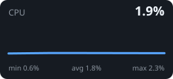
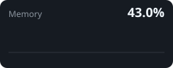
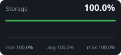

# Homelab status

🟠 **Degraded** · refreshed 31 Jul 2026 20:05 UTC

| Nodes | Pods | Containers |
|:--:|:--:|:--:|
| 0 | 0 | 0 |

  

| CPU | Memory | Storage |
|---:|---:|---:|
| 1.9% | 41.2% | 0.1 / 0.9 TB |

> Collector notices: `docker: docker unavailable or query failed: exit status 1` `kubernetes: kubectl unavailable or query failed: exit status 1` 

_Generated by [Local-AI](https://github.com/schpeterzon/homelab-stat-for-bio)._
